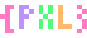

# pixelsrc

[](https://github.com/scbrown/pixelsrc/actions/workflows/ci.yml)
[](https://github.com/scbrown/pixelsrc/actions/workflows/release.yml)
[](https://github.com/scbrown/pixelsrc/actions/workflows/wasm.yml)
[](https://crates.io/crates/pxl)
[](https://www.npmjs.com/package/@stiwi/pixelsrc-wasm)
[](LICENSE)
[](https://pixelsrc.dev)

**The first pixel art format designed for GenAI.**

pixelsrc is a semantic, human-readable text format for defining pixel art. Unlike traditional editors or hex-based formats, it's designed from the ground up for AI systems to generate reliably.

```json5
// coin.pxl - A simple coin sprite
{
  type: "palette",
  name: "coin",
  colors: {
    _: "transparent",
    outline: "#8B6914",
    gold: "#FFD700",
    shine: "#FFFACD",
  },
}

{
  type: "sprite",
  name: "coin",
  size: [8, 8],
  palette: "coin",
  regions: {
    _: "background",
    outline: { stroke: [1, 1, 6, 6], round: 2 },
    gold: { fill: "inside(outline)" },
    shine: { points: [[3, 2], [4, 3]] },
  },
}
```

## Why pixelsrc?

- **Semantic regions** - Define shapes like `rect`, `circle`, `fill` instead of individual pixels
- **Context-efficient** - 64x64 sprites take the same space as 8x8 with similar structure
- **GenAI-native** - Describe intent, the compiler resolves pixels
- **JSON5 format** - Comments, trailing commas, unquoted keys for readability
- **Lenient by default** - Fills gaps and continues on small errors; strict mode available for CI

## Installation

### Homebrew (macOS/Linux)

```bash
brew install scbrown/tap/pixelsrc
```

### Cargo (from source)

```bash
cargo install --git https://github.com/scbrown/pixelsrc
```

### Download binaries

Pre-built binaries for Linux, macOS, and Windows are available on the [Releases](https://github.com/scbrown/pixelsrc/releases) page.

## Quick Start

1. Create a file `hero.pxl`:

```json5
{
  type: "palette",
  name: "hero",
  colors: {
    _: "transparent",
    outline: "#000000",
    skin: "#FFD5B4",
    hair: "#8B4513",
    eye: "#4169E1",
  },
}

{
  type: "sprite",
  name: "hero",
  size: [16, 16],
  palette: "hero",
  regions: {
    _: "background",
    "head-outline": { stroke: [4, 2, 8, 10], round: 2 },
    hair: { fill: "inside(head-outline)", y: [2, 5] },
    skin: { fill: "inside(head-outline)", y: [5, 12], except: ["eye"] },
    eye: { rect: [6, 7, 2, 2], symmetric: "x" },
  },
}
```

2. Render it:

```bash
pxl render hero.pxl -o hero.png
```

3. Scale it up:

```bash
pxl render hero.pxl -o hero.png --scale 8
```

## Features

### CLI Tool (`pxl`)

| Command | Description |
|---------|-------------|
| `pxl render <file>` | Render .pxl to PNG |
| `pxl render --gif` | Export animations to GIF |
| `pxl render --spritesheet` | Generate sprite sheets |
| `pxl fmt <files>` | Format files for readability |
| `pxl validate <file>` | Check for errors |
| `pxl palettes list` | List built-in palettes |
| `pxl import <image>` | Convert PNG to .pxl |

### Format Capabilities

- **Palettes** - Define reusable color schemes with semantic roles
- **Sprites** - Define images using geometric regions
- **Regions** - Shapes: `rect`, `stroke`, `circle`, `ellipse`, `polygon`, `fill`
- **Modifiers** - `symmetric`, range constraints (`x`, `y`), `except`
- **Animations** - Frame sequences with timing
- **Compositions** - Layer sprites into scenes
- **State Rules** - Visual states without separate sprites

### Integrations

- **[Web Editor](https://scbrown.github.io/pixelsrc/)** - Live editor with real-time preview
- **[WASM Module](https://www.npmjs.com/package/@stiwi/pixelsrc-wasm)** - Use in JavaScript/TypeScript
- **[Obsidian Plugin](obsidian-pixelsrc/)** - Render sprites in your notes

## Development

This project uses [just](https://github.com/casey/just) as a command runner:

```bash
just --list      # Show all available commands
just build       # Build the project
just test        # Run tests
just check       # Run format check, lint, and tests
just render coin # Render an example sprite
```

## Documentation

- **[Documentation Book](https://scbrown.github.io/pixelsrc/book/)** - Complete user guide with interactive examples
- [Format Specification](docs/spec/format.md) - Complete format schema
- [AI Primer](docs/primer.md) - Guide for AI generation
- [Implementation Plan](docs/plan/README.md) - Roadmap and phase status
- [Vision & Philosophy](docs/VISION.md) - Design principles
- [Contributing](CONTRIBUTING.md) - Development guide

## Use Cases

- **Game development** - Generate sprites with AI assistants
- **Prototyping** - Quick iteration on visual assets
- **Version control** - Text-based diffs for pixel art
- **Education** - Learn pixel art through readable definitions

## License

MIT - see [LICENSE](LICENSE)
