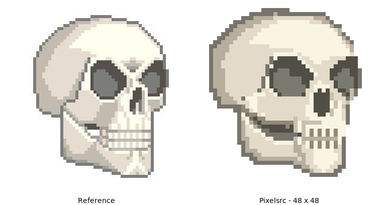

# Three-quarter skull

A 48 × 48 skull facing right, drawn in native Pixelsrc regions with a warm bone
ramp, angular recessed sockets, a notched nose, cheekbone and separate mandible.
The source reference remains in
[`../avatar-prototype/reference-skull.jpg`](../avatar-prototype/reference-skull.jpg).




## Render

From the repository root, build `pxl` with `cargo build --bin pxl`, then use that
binary (or an installed `pxl`) for these commands:

```sh
pxl validate --strict examples/skull/skull.pxl
pxl validate --strict examples/skull/skull_talking.pxl
pxl render examples/skull/skull.pxl --composition skull --strict -o examples/skull/skull.png
pxl render examples/skull/skull.pxl --composition skull --strict --scale 4 -o examples/skull/skull_4x.png
pxl render examples/skull/skull.pxl --composition skull --strict --scale 8 -o examples/skull/skull_8x.png
pxl render examples/skull/skull_talking.pxl --animation skull_talking --gif --strict --scale 4 -o examples/skull/skull_talking.gif
pxl render examples/skull/skull_talking.pxl --animation skull_talking --spritesheet --strict --scale 4 -o examples/skull/skull_poses.png
```

Every sprite PNG and the GIF are direct `pxl` output; no painted raster assets
or post-render retouching. The background is transparent. The GIF loops through
closed → small → wide → small at 120 ms per frame. The cranium stays fixed;
the mandible drops by one or three logical pixels with a dark cavity behind it.

Both `.pxl` files are standalone examples. The still's palette and components
are repeated verbatim at the beginning of `skull_talking.pxl`; keep that prefix
in sync when changing the design. Validate the two files separately, since
validating them together treats their intentionally shared names as duplicates.

The talking file uses explicit jaw-pose regions. In the current renderer,
composition-layer `shift` and source-sprite `shift` inside compositions silently
render the unshifted pose, even though direct rendering of the shifted sprite
works. This compiler limitation is tracked separately with an 8 × 8 reproducer;
the example does not rely on those transforms.

## Comparison and visual checks

`comparison.png` is a presentation image only: the existing reference enlarged
with nearest-neighbor sampling beside the unmodified 8× Pixelsrc render on white.
Regenerate it with ImageMagick:

```sh
magick \
  \( examples/avatar-prototype/reference-skull.jpg -filter point -resize 384x384 \
     -background white -gravity south -splice 0x24 -font DejaVu-Sans \
     -pointsize 14 -annotate 0 'Reference' \) \
  \( examples/skull/skull_8x.png -background white -alpha remove -alpha off \
     -gravity south -splice 0x24 -font DejaVu-Sans -pointsize 14 \
     -annotate 0 'Pixelsrc - 48 x 48' \) \
  +append examples/skull/comparison.png
```

Iterations inspected at 1× and 8×:

- Initial geometry: rounded back-left dome and asymmetric sockets established
  the turn; tooth rows were too short and the chin too empty.
- Dental revision: taller individual teeth and umber separators improved the
  bite; retained the cream forehead and beige side planes.
- Motion revision: explicit jaw poses replaced ineffective transforms. A dark
  mouth cavity keeps the opening readable on white as well as dark backgrounds.

Final checks: recognizable silhouette, readable at native size, consistent
upper-right lighting, transparent margins, three distinct jaw poses, identical
upper cranium across frames, and no strict-validation warnings. The older
avatar-prototype skull sources and renders have been retired in favor of these
examples; the reference image is unchanged.
