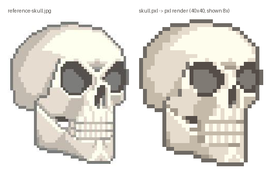
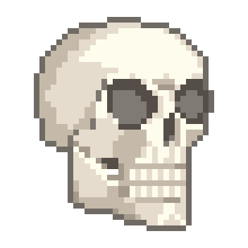
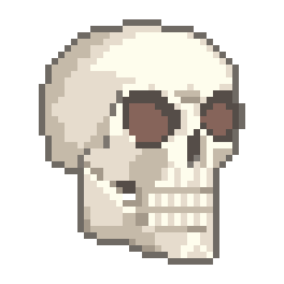
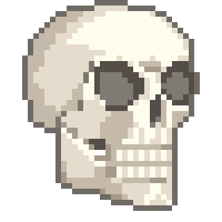
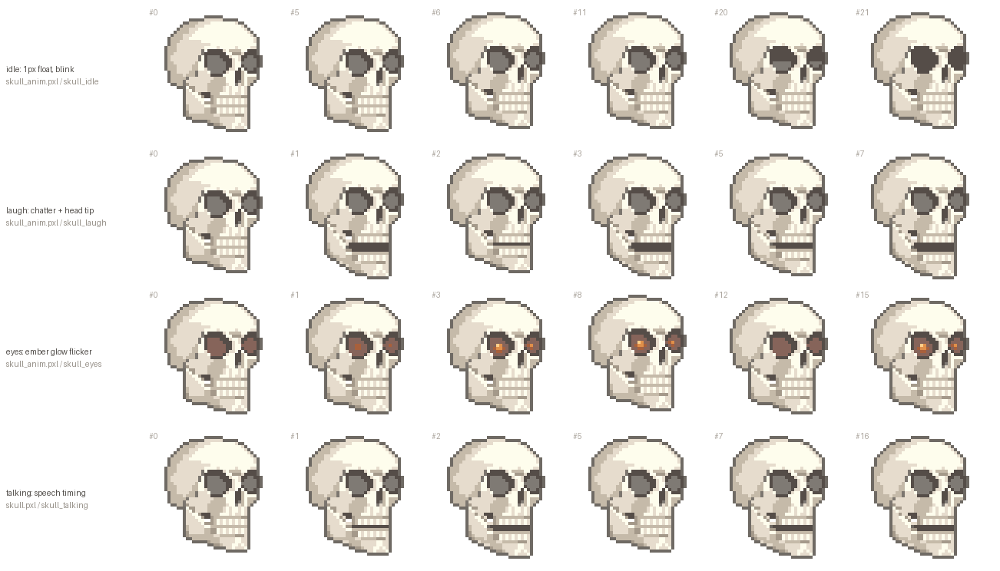
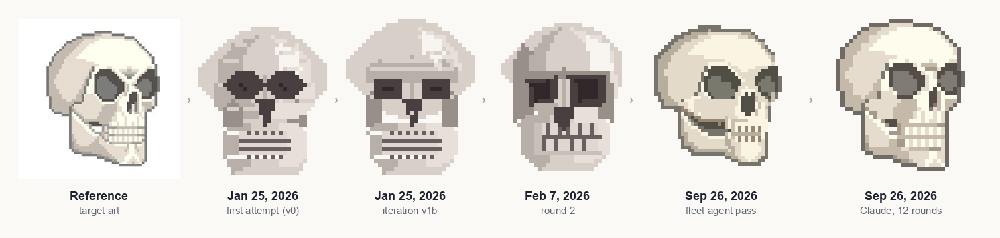

# Skull

A 3/4-view skull facing right, drawn in pixelsrc after `reference-skull.jpg`.
It's a 40x40 sprite on a transparent background. The jaw is a separate sprite,
so the skull can talk, laugh, float and glow.



| idle | laugh | eyes | talking |
|------|-------|------|---------|
|  |  |  |  |



## Files

| File | What it is |
|------|------------|
| `skull.pxl` | Source: the `bone` palette, the `skull_cranium` and `skull_jaw` sprites, two open-jaw poses (`skull_jaw_ajar`, `skull_jaw_open`), the `skull` / `skull_talk_*` compositions and the `skull_talking` animation |
| `skull.png` | The still at 1x (40x40) |
| `skull_8x.png` | The still at 8x (320x320) |
| `skull_talking.gif` | Talking at 8x, with speech-like timing: 1-3 frame syllables and holds between phrases |
| `skull_anim.pxl` | Animation source on a 44x44 canvas (room to float and drop the jaw): the skull at two head heights, a wide-open jaw pose, blink and ember-glow overlays, and the `skull_idle`, `skull_laugh` and `skull_eyes` animations |
| `skull_idle.gif` | A slow 1px float, with one blink every other bob (8x) |
| `skull_laugh.gif` | Fast jaw chatter, the head tipping up a pixel on each open (8x) |
| `skull_eyes.gif` | The idle float with ember light flickering in the sockets (8x). The `glow_1..3` overlays sit on top of any frame |
| `skull_contact_sheet.png` | A few frames from each animation |
| `contact_sheet.py` | Builds the contact sheet from `pxl render --spritesheet` strips (needs Pillow) |
| `reference-skull.jpg` | The target art |
| `skull_comparison.png` | Reference and render side by side, both skulls scaled to the same height |
| `compare.py` | Builds `skull_comparison.png` (needs Pillow) |
| `GAPS.md` | Things the compiler couldn't express, with minimal repros |

## Render

From the repo root, after `cargo build --release`:

```sh
pxl=target/release/pxl
$pxl render examples/skull/skull.pxl -c skull -o examples/skull/skull.png
$pxl render examples/skull/skull.pxl -c skull --scale 8 -o examples/skull/skull_8x.png
$pxl render examples/skull/skull.pxl --gif --animation skull_talking --scale 8 -o examples/skull/skull_talking.gif
python3 examples/skull/compare.py

for a in skull_idle skull_laugh skull_eyes; do
  $pxl render examples/skull/skull_anim.pxl --gif --animation $a --scale 8 -o examples/skull/$a.gif
done
python3 examples/skull/contact_sheet.py
```

## How it's built

- **Silhouette.** `outline` is a closed polyline (`line` with many points),
  and the cranium's `bone` is `fill: "inside(outline)"`.
- **Shading.** The back-of-skull shadow is `mid: { fill: "inside(outline)",
  except: ["lit"] }`, where `lit` is a transparent mask polygon covering the
  lit side. Other planes are small `path` polygons: the shadowed temple, the
  cheekbone underside and the far side of the face. The dome highlight is a
  `path` too.
- **Detail.** The angular orbits are `path` polygons with a lighter inner `rim`
  polygon. The nasal notch, tooth roots, ramus edge and chin ridge are `points`
  and `line`s. The teeth are two pixels each: a lit column (`tooth`) over the
  beige base. A transparent `gap` region at z 200 punches the see-through hole
  at the corner of the mouth.
- **Jaw.** `skull_jaw` is drawn over the cranium. Where it meets the skull, its
  top edge is a soft `seam`/`gum` line instead of a hard outline. The cranium
  has a dark mouth interior hidden behind the jaw, and that interior shows when
  the jaw opens. The open poses swing the mandible around the hinge: the chin
  drops 1px (ajar) or 2px (open) and the hinge stays put.
- **Order.** Every region has an explicit `z` (see GAPS.md).
- **Animation.** Compositions can't offset a layer, and derived `shift` sprites
  don't survive into GIF frames (GAPS.md #4). So `skull_anim.pxl` writes the
  cranium, jaw poses and overlays out at both head heights (`*_rest`, and
  `*_up` 1px higher), and each frame is a composition of the three layers.
  Moves are rigid and the jaw poses reuse the still's art, so the outline
  never changes shape between frames. Holds are repeated frames, because an
  animation has a single frame duration (GAPS.md #6).
- **Glow.** The `ember` palette adds four warm shades. `glow_1` warms the inner
  socket walls, `glow_2` adds a coal and `glow_3` flares it. The blink overlays
  darken the same walls to the socket colour, half and then full.

## Evolution



Animated, each version and then the four animations: [evolution.gif](evolution.gif)

Every version of this skull was written as `.pxl` and rendered by `pxl`. From left to right:

- **Reference:** the target art.
- **January 25:** the first pass and an iteration from the artisan workflow.
- **February 7:** round 2.
- **September 26:** a fleet agent's 48×48 pass (#12), then the version in this folder, which took twelve render-and-compare rounds against the reference (#13).

The earlier sources live in git history under `examples/avatar-prototype/`.
